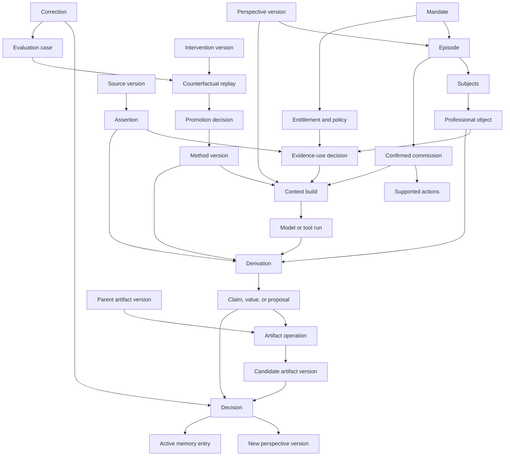

# Conceptual model

Status: proposed durable model beneath terminal, native-tool, and web views. Names may change. Relations should survive changes to interface and runtime.

## Test for a product concept

A durable concept should remain useful when:

- the analyst enters through a company, event, question, model line, theme, source, or existing note;
- the output changes from a report to a chart, calculation, workbook, or refusal;
- Claude Code replaces Codex or Codex replaces Claude Code;
- a terminal session dies or compacts;
- a web interface is added later; and
- one client keeps all data local while another uses a shared service.

A concept that disappears under those substitutions belongs to one view or runtime.

## The core relations



The graph is not a user journey. It shows which facts should exist before another fact may acquire authority.

## Mandate

The mandate states the outer professional and legal boundary.

A mandate may represent one analyst, a small team, a fund, a client engagement, or another authorised body of work.

It should contain:

- owner and participating people;
- professional remit;
- permitted decision uses;
- jurisdiction and reporting regime where relevant;
- source and model-provider rights;
- retention and sharing rules;
- team policies;
- people allowed to grant exceptions;
- local or shared storage policy; and
- effective dates.

A model may help interpret a mandate document. A model may not broaden the mandate.

The mandate prevents one client’s evidence, methods, memories, or agent credentials from becoming another client’s context.

## Episode

An episode records one bounded body of work beginning from an event, question, artifact, or request.

Examples include:

- post-results work on Micron;
- a cross-company question about HBM capacity;
- a regression over a Bloomberg export;
- a meeting whose consequences need to enter later work;
- a proposed model section;
- a broker revision that may touch a portfolio exposure; or
- a visual explanation of a complex process.

An episode should name:

- the exact original request or trigger;
- its mandate;
- the perspective version from which work begins;
- evidence cutoff;
- intended use when known;
- subjects touched;
- current state;
- active decisions; and
- produced artifacts.

A task, model call, terminal pane, or work order may belong to an episode. It does not replace the episode.

## Perspective version

A perspective records whose prior account the work begins from.

The same subject may have several perspectives:

- one analyst’s view and another analyst’s dissent;
- base, bull, and bear scenarios;
- pre-results and post-results accounts;
- internal view and consensus comparison;
- historical view preserved for audit; and
- present view used for current work.

A perspective version should point to separately typed items:

- supported observations;
- active claims;
- assumptions;
- methods;
- open questions;
- professional-object mappings;
- artifacts in use;
- prior decisions; and
- stated uncertainties.

A readable summary may be rendered from these items. The summary should not become an independent fact source.

Later work should begin from an exact perspective version. It should not begin from “whatever the latest summary says”.

## Subject

Subjects let one episode touch several parts of professional work without forcing a universal company root.

Subjects may include:

- company;
- security;
- segment;
- supplier;
- customer;
- theme;
- portfolio exposure;
- model;
- model object;
- thesis claim;
- assumption;
- source statement;
- industry process;
- question; or
- artifact.

The list should remain extensible. A subject identifies what the work concerns. It does not determine the workflow.

## Original request, proposed interpretation, and confirmed commission

The system should preserve three records.

### Original request

The analyst’s exact words, files, selections, and entry surface.

### Proposed interpretation

The research lead’s proposed account of:

- purpose;
- relevant prior work;
- likely subjects;
- evidence needs;
- candidate methods;
- supported outputs;
- intended use;
- source-rights limits;
- material unknowns; and
- proposed stopping conditions.

Every inferred field should state its basis and author.

### Confirmed commission

The version accepted or amended by the analyst for execution.

Confirmation should remain selective. The analyst should not complete a long form when prior policy or exact project state already supplies the answer.

A confirmed commission authorises research within stated limits. It does not approve later claims, artifacts, or methods.

## Source version

A source version is exact captured material.

It should contain:

- content hash;
- bytes or a lawful immutable reference;
- source and provider identity;
- capture route;
- publication time;
- event time where known;
- time first available to the operating identity;
- capture time;
- document or data type;
- entity and jurisdiction where established;
- entitlement and retention facts;
- amendment or withdrawal relations;
- parser version; and
- capture diagnostics.

A model-written URL does not create a source version.

A source may be readable without being retainable. It may be retainable without being shareable. The source record should preserve those differences.

## Assertion

An assertion identifies one value, statement, table entry, or other atomic item within a source version.

The two appearances of `37,378` in the Micron earnings release and annual filing are separate assertions.

An assertion may contain:

- exact locator;
- quoted or structured content;
- metric or proposition;
- entity;
- period;
- unit and scale;
- accounting basis;
- scope;
- speaker or author;
- statement kind such as fact, forecast, intention, estimate, or persuasion;
- extraction method;
- verification state; and
- unresolved interpretation.

A model may propose an assertion. Host software should issue the assertion identity only after capturing the source relation and checking every deterministic field it can check.

## Professional object

A professional object states what an artifact element, claim, estimate, or question means in the analyst’s work.

For a model line:

```text
issuer: Micron Technology
metric: revenue
period: fiscal year ended 2025-08-28
unit: USD millions
accounting basis: GAAP
scope: consolidated
role: reported historical input
method: filed annual report once available
intended use: post-results internal model
```

The workbook binding remains separate:

```text
artifact version: exact workbook digest
sheet: Historical Financials
named range: FY25_REVENUE_USDM
cell: D42
```

Cell `D42` is a structural locator. The professional object supplies meaning.

A professional object may also represent:

- a thesis claim;
- a scenario assumption;
- a management statement under comparison;
- an estimate;
- a chart series;
- a statistical construct;
- an open question; or
- a paragraph in a note.

A model may propose the mapping. An analyst, prior confirmed mapping, or authorised policy must supply authority where the meaning changes consequential work.

## Method version

A method states how evidence, assumptions, calculations, and artifact operations may produce professional work.

A method may include:

- source hierarchy;
- period and scope rules;
- calculation formula;
- normalisation;
- allocation;
- bridge logic;
- scenario treatment;
- treatment of missing evidence;
- uncertainty requirements;
- challenge procedure;
- artifact adapter;
- stopping conditions; and
- conditions that cause the method to expire or require review.

A formula is part of a method. It is not the whole method.

A method should have:

- author or approving authority;
- scope;
- version;
- effective date;
- expiry or review condition;
- supporting evaluation cases;
- known exceptions;
- rollback relation; and
- current status.

One corrected episode creates a method candidate at most.

## Evidence-use decision

Evidence admission is a relation rather than a global source label.

```text
assertion
x professional object
x method
x intended use
x evidence cutoff
x mandate
-> permitted actions
```

Permitted actions may include:

- inspect during discovery;
- use to generate a lead;
- use as evidence of market belief;
- use as support for a claim;
- use as an input to a calculation;
- use in an artifact operation;
- quote in an output;
- share with specified people;
- retain in the archive; and
- promote into active memory.

`Admitted`, `quarantined`, and `rejected` may remain convenient views.

- Admitted material may support the named use.
- Quarantined material may be inspected in a separate context but may not support the relied-upon result.
- Rejected material remains outside model contexts for the episode, subject to the retained identity and rejection reason.

The stronger invariant is:

> No unpermitted assertion may support a relied-upon claim, artifact operation, or active-memory entry.

## Context build

A context build records exactly what one model or tool could see.

It should contain:

- episode and commission version;
- prior perspective items included;
- source assertions included;
- artifact versions included;
- method and skill versions;
- task instruction;
- model and runtime configuration;
- tool grants;
- excluded items and reasons;
- evidence cutoff;
- budget;
- context manifest hash; and
- materialisation paths or content references.

Discovery, analysis, claim writing, criticism, calculation, and artifact mutation may receive different context builds.

A context build makes evidence exclusion testable. It also supports exact historical replay.

A Pydantic model may validate the manifest. The local service decides the actual materialised population.

## Model or tool run

A run records one execution against one context build.

It should contain:

- runtime adapter;
- provider and model;
- process identity;
- working directory;
- start and end time;
- stdout and stderr where applicable;
- tool calls;
- exit state;
- output population;
- Langfuse or other observation links;
- model-written attestation; and
- host custody result.

A session manager reporting `complete` does not establish successful work. The host needs a known process result and exact output population.

Persistent sessions may improve context economy for long work. Durable state should survive session death.

## Derivation

A derivation records how one or more assertions, assumptions, methods, and prior objects produced a claim, value, chart, or proposal.

Relations may include:

- supports;
- contradicts;
- qualifies;
- informs;
- derives;
- estimates;
- normalises;
- allocates;
- maps;
- supersedes;
- invalidates; and
- remains unresolved against.

A derived free-cash-flow value may combine several assertions and one analyst-approved formula. The final value should not pretend to be quoted from one source.

A management comparison may preserve conflicting statements without selecting a winner.

The derivation should contain:

- exact inputs;
- method version;
- calculation code or formula where applicable;
- engine and environment;
- output;
- uncertainty;
- unresolved contradictions;
- producing run; and
- verification result.

## Claim, value, and proposal

A claim is a candidate proposition. A value is a candidate numerical object. A proposal asks to change professional work.

The objects should preserve:

- exact derivation;
- current support status;
- claimed scope;
- uncertainty;
- contradictions;
- author;
- claim ceiling;
- affected professional objects; and
- later decisions.

A syntactically valid proposal remains provisional.

## Artifact version and operation

An artifact version is an exact native or rendered object:

- workbook;
- note;
- chart;
- dataset;
- mini-model;
- presentation;
- dashboard export;
- source bundle; or
- another professional file.

An artifact operation should name:

- exact parent version;
- professional object affected;
- operation type;
- admitted inputs;
- derivation;
- adapter and version;
- calculation or rendering engine;
- changed structural elements;
- unsupported features;
- candidate descendant; and
- validation result.

The original remains intact. Correction creates another descendant.

For a workbook, the operation may also record formulas, dependencies, cached values, engine version, calculation mode, locale, external links, macros, and unsupported functions.

## Grant

The architecture should not hard-code five permission types. It should use a general grant.

```text
grantor
grantee
action
object
purpose
valid from
valid until
conditions
delegation
precedence
revocation effect
reason
policy version
```

Common actions include:

- inspect evidence;
- use an assertion as support;
- perform an artifact operation;
- rely on an artifact;
- quote or share material;
- add an item to active memory;
- schedule monitoring;
- apply a method to later cases; and
- grant an exception.

Legal and licence restrictions set the outer boundary. Team policy may narrow an individual grant. An analyst may broaden a policy only when explicit exception authority permits it.

Expiry should block new use without rewriting history.

Revocation should state whether descendants remain historically valid, become stale for present use, require withdrawal, or require recomputation.

## Decision

A decision records an attributed professional act over an exact object.

Examples include:

- confirm meaning;
- amend meaning;
- use a claim for one note;
- use a workbook candidate for one model;
- reject a proposal;
- leave an issue unresolved;
- permit a source exception;
- add a distinction to active memory;
- promote a method candidate; and
- revoke a prior grant.

Artifact use, claim acceptance, memory promotion, and method promotion should remain separate decisions.

Downloading a file should not silently approve its claims or method.

## Correction

A correction identifies:

- exact prior state;
- object corrected;
- original proposal;
- attributed correction;
- reason;
- corrected result;
- affected descendants;
- scope; and
- possible later lesson.

The correction should repair the current work first.

The system may then create an evaluation-case candidate. It should not update a global skill or method automatically.

## Active memory and archive

The archive preserves exact source material, runs, outputs, prior perspectives, and decisions.

Active memory contains only material that may affect later work:

- analyst-confirmed meaning;
- active assumption;
- stated method;
- unresolved question;
- relied-upon artifact;
- source rule with stated scope;
- decision rationale; and
- correction whose scope has been confirmed.

A model may propose an active-memory entry. An authorised person or standing rule must permit it.

Active memory should carry author, scope, effective date, expiry, support, and supersession.

## Evaluation case

An evaluation case preserves an exact historical episode or a synthetic construction.

It may contain:

- prior perspective version;
- original request;
- confirmed commission;
- exact source and artifact population;
- context builds;
- baseline method and model versions;
- original proposal;
- analyst correction or expected result;
- protected assertions and exclusions;
- expected artifact consequences;
- cost and review measures; and
- claim ceiling.

A case should state what it can prove.

The Micron equal-value case proves whether the system preserves and applies a purpose-specific evidence relation. It does not prove general research quality.

## Counterfactual replay

A replay holds the historical case fixed and changes one intervention where possible.

The replay specification should name:

- baseline objects;
- intervention changed;
- constants held fixed;
- expected differences;
- measures;
- non-deterministic comparison method;
- protected regressions; and
- result ceiling.

Possible interventions include:

- prompt;
- skill;
- model;
- context-selection rule;
- source-use policy;
- method;
- tool;
- challenge step;
- memory retrieval; and
- artifact adapter.

A replay result should compare claims, derivations, unsafe routes, legitimate blocks, review burden, cost, latency, artifact consequences, and later memory.

## Promotion decision

A method, skill, prompt, or software rule may move into broader use only after:

- the intended class is named;
- varied cases cover the dimensions claimed;
- the cause of the earlier defect is understood;
- shadow or warning use has been considered where false blocks matter;
- protected cases and held-out cases pass;
- scope and approver are explicit;
- rollback exists; and
- later overrides and harm remain observable.

Some corrections should promote a question or clearer display rather than a rule.

## Typed boundary sketch

The exact schemas remain open. The boundary pattern should preserve authority.

```python
class InferredField[T](BaseModel):
    value: T
    status: Literal["observed", "inferred", "confirmed", "rejected"]
    basis: list[ObjectRef]
    proposed_by: RunRef | None
    confirmed_by: ActorRef | None


class CommissionDraft(BaseModel):
    original_request: ObjectRef
    purpose: InferredField[str]
    prior_perspective: InferredField[ObjectRef | None]
    subjects: list[InferredField[ObjectRef]]
    evidence_needs: list[EvidenceNeed]
    candidate_methods: list[ObjectRef]
    candidate_actions: list[ActionProposal]
    intended_use: InferredField[str | None]
    unresolved_questions: list[Question]


class ContextManifest(BaseModel):
    episode: ObjectRef
    commission: ObjectRef
    included_objects: list[ObjectRef]
    excluded_objects: list[Exclusion]
    method_versions: list[ObjectRef]
    skill_versions: list[ObjectRef]
    tools: list[ToolGrant]
    evidence_cutoff: datetime
    digest: str


class DerivationRecord(BaseModel):
    inputs: list[ObjectRef]
    relations: list[DerivationRelation]
    method: ObjectRef
    producing_run: ObjectRef
    output: ObjectRef
    uncertainty: list[Uncertainty]


class ReplaySpec(BaseModel):
    evaluation_case: ObjectRef
    baseline: ObjectRef
    intervention: ObjectRef
    constants: list[ObjectRef]
    measures: list[Measure]
```

The models check boundary shape. The local service still owns object issuance, content hashes, grants, and state changes.

## Views over the model

Several interfaces may render the same state.

### Terminal research lead

Shows the proposed interpretation, active work, useful outputs, and unresolved decisions.

### Event workbench

Shows one episode against its prior perspective.

### Company or theme view

Shows relevant active claims, questions, artifacts, events, and decisions.

### Native artifact companion

Shows one professional object, proposed operations, evidence, dependencies, and candidate descendants.

### Consultant workbench

Shows blocked evidence, model interpretations, corrections, evaluation cases, method candidates, and measured human intervention.

### Operator view

Shows context builds, process state, outputs, hashes, traces, and custody.

### Audit and replay view

Walks from an output to its licence and re-derives the result under the baseline or one counterfactual.

No view should create a second source of truth.

## Relations that code must make impossible to fake

- A run cannot cite a source version that the source service did not issue.
- A model cannot add excluded evidence to its own context manifest.
- A claim cannot be marked supported without a derivation and permitted evidence use.
- A candidate artifact cannot overwrite its parent.
- A candidate cannot acquire use authority from run completion.
- A correction cannot rewrite the original proposal.
- An artifact-use decision cannot promote a method automatically.
- A model-written summary cannot enter active memory without a grant.
- A method cannot promote itself.
- A replay cannot claim causality when several interventions changed together.

## Open questions

- Should the local canonical store use one SQLite database or separate ledgers for objects, grants, and execution?
- Which source bytes may be stored locally under common broker, expert-network, and data-provider licences?
- Which professional objects should the first version support explicitly, and which should remain typed extensions?
- How much of the perspective may be inferred before analyst confirmation becomes necessary?
- Which replay grades should block method release?
- Which artifact action gives the first buyer enough value to justify direct native-tool work?
- How should shared-team conflict between perspectives be shown without forcing premature synthesis?
- What materiality information can be derived from dependencies, and what must remain an analyst setting?
- Which parts of the existing Django model can serve this graph without preserving campaign-shaped assumptions?
